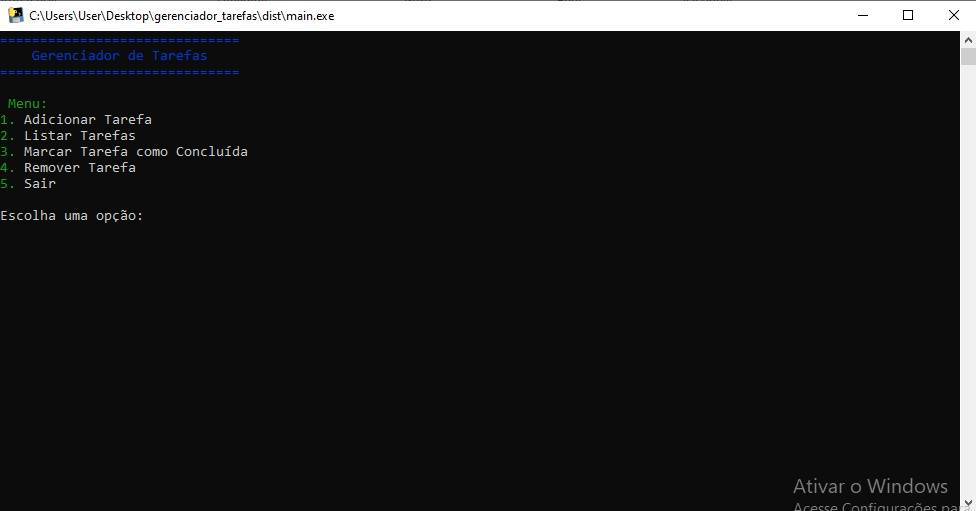
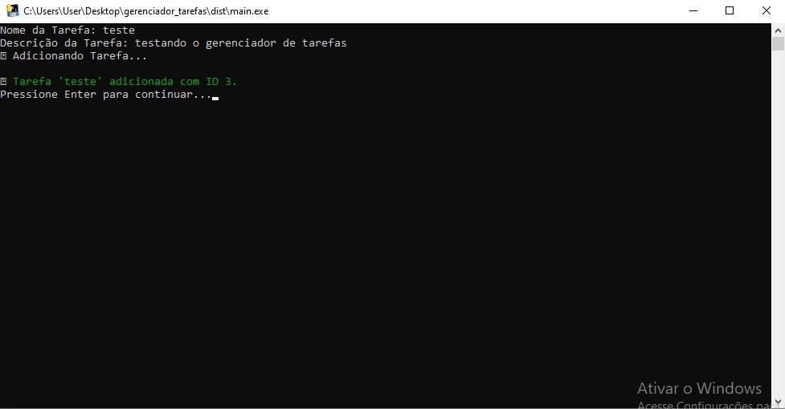
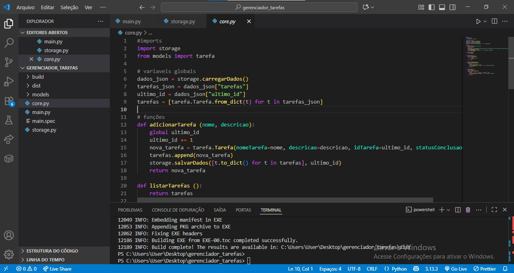

# 🗂️ Gerenciador de Tarefas em Python (CLI)

Este é um projeto pessoal desenvolvido para testar e aplicar conhecimentos em **Python puro**, **POO (Programação Orientada a Objetos)** e **estruturas de dados**, através da criação de um simples (mas bem estruturado) **gerenciador de tarefas no terminal (CLI)**.

> 💬 “Mais que um CRUD — esse projeto foi um laboratório de aprendizado e refatoração.”

---

## 📸 Capturas de Tela

| Menu Principal | Adicionando Tarefa | Desenvolvendo |
|---------------|--------------------|----------------|
|  |  |  |

> 📁 As imagens devem ser colocadas em uma pasta `/screenshots/` no repositório.

---

## ✨ Funcionalidades

- ✅ Adicionar tarefas com nome e descrição  
- 📋 Listar todas as tarefas com status e data de criação  
- ✔️ Marcar tarefas como concluídas  
- 🗑️ Remover tarefas por ID  
- 💾 Persistência dos dados em JSON  
- 🎨 Interface colorida no terminal com `colorama`  
- 💬 Animações e efeitos de digitação simulados  
- 💻 Suporte a `.exe` com `pyinstaller`  
- 👤 Tela de “Sobre o Dev” com reflexão pessoal  

---

## 🧠 Aprendizados e Desafios

Durante o desenvolvimento, aprimorei os seguintes pontos:

- Estrutura modular e separação de responsabilidades  
- Manipulação de arquivos `.json` como banco de dados local  
- Planejamento e refatoração da arquitetura após erros iniciais  
- Aplicação prática de Programação Orientada a Objetos  
- Personalização e UX em linha de comando (CLI)  
- Geração de executáveis com `PyInstaller`  

---

## 🔧 Tecnologias Utilizadas

| Tecnologia | Uso |
|------------|-----|
| `Python 3` | Lógica principal |
| `Colorama` | Estilização CLI |
| `JSON` | Armazenamento local |
| `PyInstaller` | Compilação `.exe` |

---

## 📦 Como Executar Localmente

### 🔹 Clonando o projeto
```bash
git clone https://github.com/seu-usuario/gerenciador-tarefas-cli.git
cd gerenciador-tarefas-cli

### 🔹 Instalando dependências
```bash
pip install colorama
```

### 🔹 Executando
```bash
python main.py
```

---

## 📌 Observações

- O sistema salva os dados localmente em `dados.json`
- Ao compilar para `.exe`, há fallback ASCII para compatibilidade
- Ideal para estudo de POO e arquitetura modular

---

## 📄 Licença

Projeto pessoal sob licença **MIT**.  
Sinta-se à vontade para usar, modificar e contribuir!

---

## 👨‍💻 Sobre o Desenvolvedor

Feito com 💙 por **Igor** — entusiasta de programação, educação e tecnologia.

> *"Cada pequeno projeto é um passo em direção a algo maior."*
